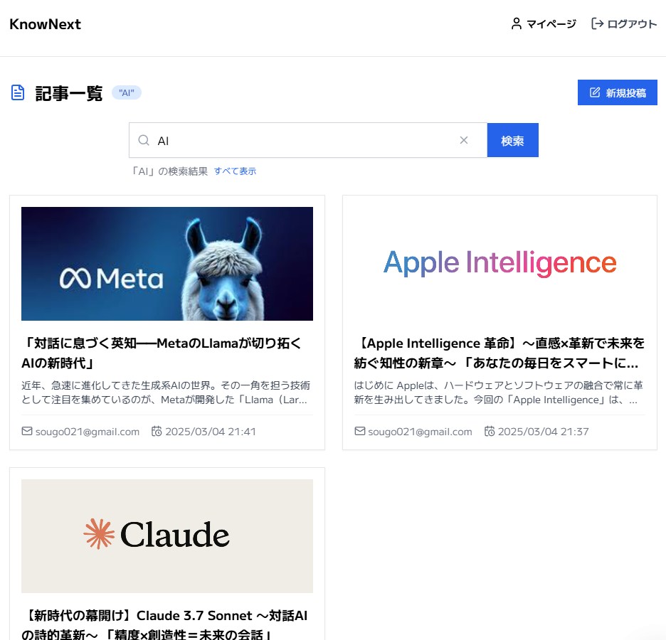
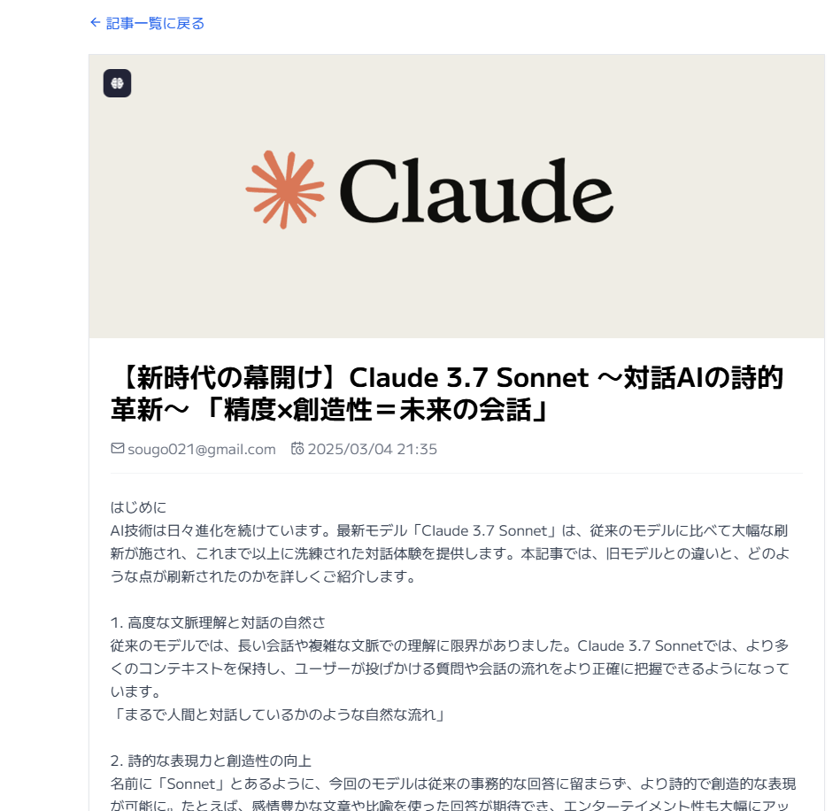
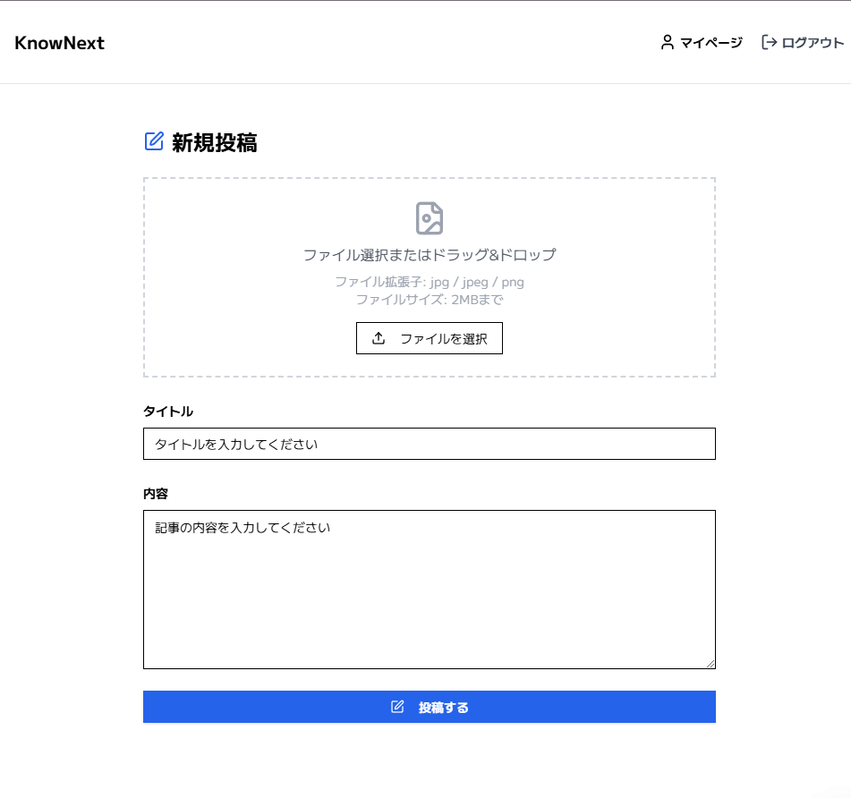

# アプリ URL

[https://knownext-gamma.vercel.app](https://knownext-gamma.vercel.app)

# アプリについて

ナレッジ共有やアウトプットを目的とした社内ブログです。
新規投稿を押すと、記事作成ができます。

## ログイン画面

メールアドレスとパスワードを入力すれば、メールアドレスに本登録の案内メールが届きます。そのメール中の URL をクリックすることで登録完了です。
パスワードリセット機能は開発中です

## メイン画面

投稿された記事を閲覧できるホーム画面です。

## 検索機能

キーワードを入力すれば、関連する記事を検索できます。

## 記事詳細画面

気になる記事をクリックすると、記事の全文を閲覧できます。

## コメント投稿画面

気になる投稿にコメントができます。

## 記事編集、削除

記事投稿者当人なら、編集と削除ができます。

## 新規投稿画面

タイトル、内容を記入すれば記事を投稿できます。タイトル画像も載せれます。

## マイページ画面

マイページでは自分が今まで投稿した記事一覧が閲覧できます。

# 使用技術

## 【フロントエンド】

### Next.js (React)
Next.jsをベースに採用し、Reactのコンポーネント設計の思想に基づいた効率的な開発を行っています。モダンなUIと優れたユーザー体験を提供するための基盤となっています。
### TypeScript
強力な型システムを活用することで、開発段階でのエラー検出を可能にし、コードの品質と保守性を高めています。チーム開発においても安全性と効率性を向上させる重要な要素となっています。

### Tailwind CSS
ユーティリティファーストのアプローチで迅速なスタイリングを実現しています。tailwindcss-animateによるアニメーション効果やtailwind-mergeを用いた柔軟なクラス結合も活用し、洗練されたデザインを効率的に構築しています。
### Radix UI
アクセシビリティを考慮した高品質なUIコンポーネントとして、以下のライブラリを採用しています：

@radix-ui/react-icons
@radix-ui/react-label
@radix-ui/react-slot

### UI補助ライブラリ

lucide-react: 美しく一貫性のあるアイコンセットを提供
react-hot-toast: ユーザーフレンドリーな通知システムの実装

### フォーム管理とバリデーション

react-hook-form と @hookform/resolvers: パフォーマンスに優れたフォーム状態管理
zod: 堅牢なスキーマ定義とバリデーション処理

### ユーティリティ

clsx と class-variance-authority: 条件に応じた効率的なクラス名の管理
date-fns と dayjs: 柔軟で直感的な日付操作
uuid: 安全なユニークID生成
base64-arraybuffer: バイナリデータと文字列間の効率的な変換処理

## 【バックエンド】

### Supabase
@supabase/auth-helpers-nextjs、@supabase/ssr、@supabase/supabase-js を利用し、認証機能やデータ管理を実現しています。
画像処理・アップロード
sharp: サーバーサイドでの画像加工に使用
react-images-uploading: 画像アップロード機能の実装

## 【バージョン管理】

### GitHub
ソースコードは https://github.com/hiro0211/knownext で管理しています。

## 【デプロイ】

### Vercel
Vercel を利用して、CI/CD 環境の下でアプリをデプロイしています。
【API】

Supabase API
Supabase の提供する API を利用して、データベース操作や認証を行っています。

## 【環境変数】

.env ファイルを作成し、以下の環境変数を設定してください。

![NEXT_PUBLIC_SUPABASE_URL=YOUR_SUPABASE_URL
NEXT_PUBLIC_SUPABASE_ANON_KEY=YOUR_SUPABASE_ANON_KEY]
