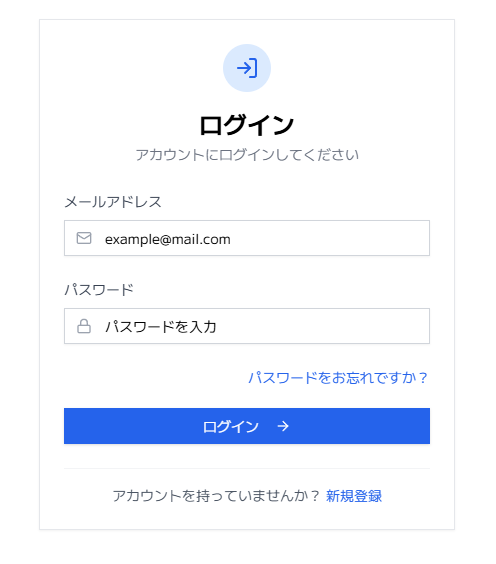
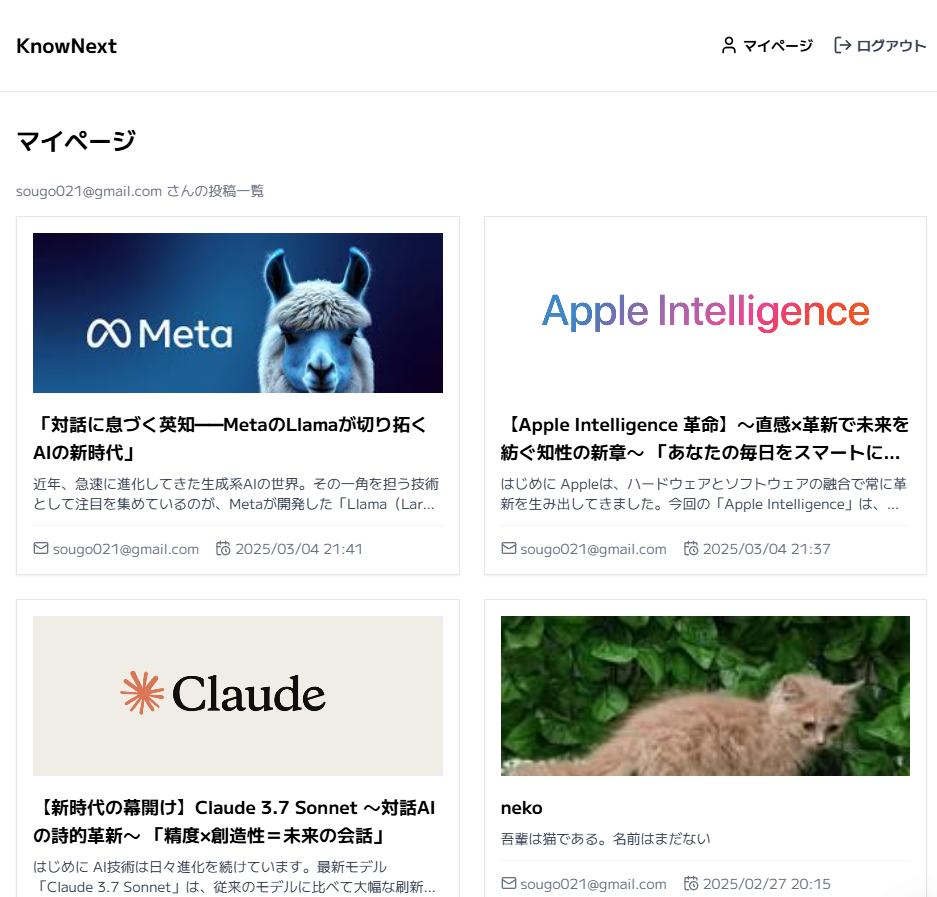

#アプリ URL
[https://knownext-gamma.vercel.app](https://knownext-gamma.vercel.app)

#アプリについて
ナレッジ共有やアウトプットを目的とした社内ブログです。
新規投稿を押すと、記事作成ができます。

##ログイン画面

メールアドレスとパスワードを入力すれば、メールアドレスに本登録の案内メールが届きます。そのメール中の URL をクリックすることで登録完了です。
パスワードリセット機能は開発中です

##メイン画面

投稿された記事を閲覧できるホーム画面です。

##検索機能
キーワードを入力すれば、関連する記事を検索できます。

##記事詳細画面
気になる記事をクリックすると、記事の全文を閲覧できます。

##コメント投稿画面
気になる投稿にコメントができます。

##記事編集、削除
記事投稿者当人なら、編集と削除ができます。

##新規投稿画面
タイトル、内容を記入すれば記事を投稿できます。タイトル画像も載せれます。

##マイページ画面
マイページでは自分が今まで投稿した記事一覧が閲覧できます。

#使用技術
使用技術
【フロントエンド】

Next.js (React)
Next.js をベースに、React によるコンポーネント設計で開発しています。
TypeScript
型安全性を高め、開発効率を向上させています。
Tailwind CSS
ユーティリティファーストの CSS フレームワークを採用。tailwindcss-animate や tailwind-merge も利用しています。
Radix UI
アクセシブルな UI コンポーネントとして、@radix-ui/react-icons、@radix-ui/react-label、@radix-ui/react-slot を導入。
UI 補助ライブラリ
lucide-react: アイコンライブラリ
react-hot-toast: 通知機能の実装
フォーム管理・バリデーション
react-hook-form と @hookform/resolvers による効率的なフォーム管理
zod によるスキーマバリデーション
その他ユーティリティ
clsx と class-variance-authority による動的クラス名管理
date-fns と dayjs で日付処理
uuid によるユニーク ID 生成
base64-arraybuffer を用いたデータのエンコード処理
【バックエンド】

Supabase
@supabase/auth-helpers-nextjs、@supabase/ssr、@supabase/supabase-js を利用し、認証機能やデータ管理を実現しています。
画像処理・アップロード
sharp: サーバーサイドでの画像加工に使用
react-images-uploading: 画像アップロード機能の実装
【バージョン管理】

GitHub
ソースコードは https://github.com/hiro0211/knownext で管理しています。
【デプロイ】

Vercel
Vercel を利用して、CI/CD 環境の下でアプリをデプロイしています。
【API】

Supabase API
Supabase の提供する API を利用して、データベース操作や認証を行っています。
【環境変数】
.env ファイルを作成し、以下の環境変数を設定してください。

ini
コピーする
NEXT_PUBLIC_SUPABASE_URL=YOUR_SUPABASE_URL
NEXT_PUBLIC_SUPABASE_ANON_KEY=YOUR_SUPABASE_ANON_KEY
